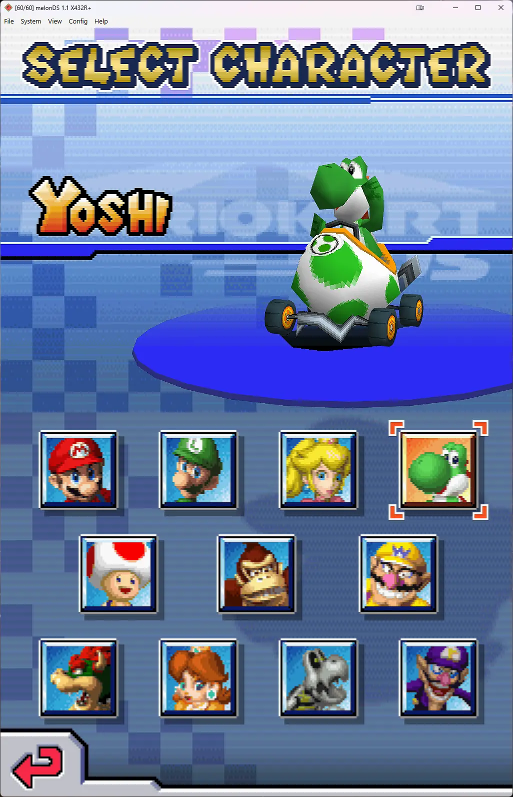

<h1 align="center"><b>melonDS X432R+</b></h1>

melonDS X432R+ is an experimental fork of [melonDS](https://github.com/melonDS-emu/melonDS). 
It is like the old DeSmuME X432R fork, but for users that want to 
upscale 2D graphics and 3D textures.

This is not the official melonDS release. If you want a stable emulator, 
use the official melonDS builds.

Nintendo DS games use many different graphics tricks, so some enhancements  
can cause visual problems. In most games, though, you can turn on at least  
some of the features and things will look noticeably better.

## Main Additions

- Anisotropic filtering.
- 3D texture scaling using the GPU (Spline36, xBRZ, ArtCNN, ArtCNN DN, 
  NNEDI3, and CuNNy).
- Whole-scene 2D scaling modes for UI, sprites, title screens, text, menus, and
  mixed 2D/3D scenes.
- `Hybrid Upscale`, the main 2D scaling mode, which tries to combine sharp 3D
  with cleaner scaled 2D. When different things make scaling unsafe, it falls
  back to the low-res image for those pixels.
- `Postprocessing Upscale`, the other major mode, which scales up a downscaled
  3D image. This is less likely to have weird scaling issues than the Hybrid
  mode, but the 3D will look soft.
- An OpenGL MSAA option.
- A screen sharpening filter for blurry output.
- Debug tools for whole-scene 2D, texture-scaling inspection, timings, 
  replays, and renderer comparison.
- FMV fixes. Some FMVs were broken in the beta build I forked.

All the work in this fork targets the OpenGL renderers. The software
renderer wasn't touched (besides the FMV fixes that apply to it too).

## How It Looks

  <b>Mario Kart</b> 
  No Upscale vs. X432R+ Upscale 
  Hybrid Upscale + Anisotropic Filtering + Texture Scaling + 3D MSAA, ArtCNN DN 
  

## Recommended Setup

For normal use:

1. Open Config -> Video settings.
2. Use `OpenGL (Compute shader)`.
3. Set `Resolution scale` to the value you normally want, such as 4x.
4. Enable `Whole-scene 2D scaling`.
5. Set the mode to `Hybrid Upscale`.
6. Click `Recommended Settings`.

The compute shader renderer needs OpenGL 4.3. The neural scalers (ArtCNN,
NNEDI3, and CuNNy) are also much heavier than Spline36, so older GPUs may
struggle with them at higher resolution scales.

`Recommended Settings` does not force every feature on. The button mainly 
resets the advanced settings to what worked best in my testing.

The video settings dialog also has helpful tooltips. Click the `?` button
in the dialog, then click a setting to see what it does.

## Which Settings To Try

- `Hybrid Upscale`
  - Use it for: High-res whole-scene scaling. Preserves high-resolution 3D 
    where safe and improves 2D when it isn't risky to do it.
  - Tradeoff: Best looking, but also the most complex. It just doesn't work right
    in some games.
- `Postprocessing Upscale`
  - Use it for: Safe whole-scene scaling. It scales the final image drawn by 
    melonDS. It can look good in games that draw 2D images with 3D textures
    (e.g. Final Fantasy Tactics A2 or Professor Layton)
  - Tradeoff: 3D will look low resolution or blurry.
- `3D MSAA`
  - Use it for: Removing jagged edges.
  - Tradeoff: Mostly useless in the compute renderer since that one does this by
    default. May cause stray black lines in games that use 3D textures as 2D art
    (e.g. New Super Mario Bros.).
- `Anisotropic filtering`
  - Use it for: Reducing shimmer on slanted or distant 3D textured surfaces.
  - Tradeoff: Can make games look a bit blurry. Can cause texture-edge
    artifacts.
- `3D texture scaling`
  - Use it for: Upscaling textures. In some games where the textures are right
    up in your face this can make them look far better.
  - Tradeoff: Higher risk. It can stutter or produce texture-edge artifacts.
- `Reduce 2D texture artifacts`
  - Use it for: Cleaning up thin lines, blocky textures, or stray pixels on UI
    and sprites after enabling anisotropic filtering or texture scaling.
  - Tradeoff: Can be a performance hit, and it will not fix every game.

`3D texture scaling` and `Anisotropic filtering` are worth testing in most
games, but both might cause texture-edge artifacts (weird lines all over the
place). Anisotropic filtering is less of a performance hit than texture
scaling. You will likely want to have either `Frequent-change protection` or
`Deferred scaling` on if you are using texture scaling to prevent framerate drops.
If cutout edges look blocky with texture scaling on, try
`Cleaner transparent edges`.

Algorithm-wise, `ArtCNN DN` usually looks the best in my opinion. 
`NNEDI3` is an alternative when `ArtCNN DN` doesn't work with a game's art style. 
`ArtCNN` is sharper if you like that look. 
`CuNNy` is similar to `ArtCNN`, but a bit less sharp. 
`XBRZ` will hide texture scaling artifacts the best.  
`Spline36` will be the fastest and least likely to kill your GPU.  

Advanced modes such as `Presentation Overlay Upscale`, `Native Stack Upscale`
and `High-resolution Compositor` are mostly for comparison and debugging.
However, some games may look better in `Presentation Overlay Upscale`
or `Native Stack Upscale` than they do in `Hybrid Upscale`.

If you get slowdowns when using 2D scaling, try either changing your
scaling algorithm, or changing the fragmented-frame fallback setting.

By default, `Postprocessing Upscale` mode renders 3D at high resolution and
then downsamples it, unless `Render 3D at native resolution` is checked.
To reduce shimmering it can be helpful to enable either 3D texture scaling or
anisotropic filtering. Also, sometimes the game will look better (less blurry)
in `Postprocessing Upscale` mode when you toggle `Render 3D at native resolution`
and turn `3D MSAA` on. `OpenGL (Classic)` can also sometimes look better than
`OpenGL (Compute shader)` or vice versa.

If the output looks too blurry, turn on `Screen sharpening`.

## Known Limits

- Hybrid Upscale is conservative on purpose. Native-looking output may be a
  fallback just because the alternative looks far worse. It is not automatically
  a bug.
- Edge cases involving blending, screen masks, display capture, and brightness  
  effects are all things that can cause the 2D scaling to fall back.
- Scrolling and affine scenes are often scaled poorly.
- Text may look darker after scaling with most algorithms except xBRZ. This is
  mostly unavoidable with how the scaling is done.
- 3D texture scaling is optional and performance-sensitive. Deferred scaling and
  frequent-change protection help, but you may still get hitches.
- You will see the edges of textures and get weird-looking UI at times with 
  anisotropic filtering and texture scaling. This is not easily fixed, but
  `Reduce 2D texture artifacts` helps in some games.
- 3D MSAA will sometimes cause sporadic black or bright lines to appear.

## BIOS, Firmware, And Games

You need your own legally obtained game dumps. Firmware boot, as opposed to
direct boot, requires BIOS and firmware dumps from an original DS or DS Lite.

Possible firmware sizes:

- 128 KB: DSi/3DS DS-mode firmware, reduced because it lacks bootcode.
- 256 KB: regular DS firmware.
- 512 KB: iQue DS firmware.

DS BIOS dumps from a DSi or 3DS can be used for DS-mode compatibility. DSi-mode
BIOS dumps are not the same thing.

## Building

See [BUILD.md](./BUILD.md) for build instructions on Linux, Windows, macOS, and
Nix. X432R+ does not require a separate build system.

## Relationship To melonDS

This fork depends on upstream melonDS and keeps its licensing and much of its
project structure. X432R+ changes are renderer-focused.

Please do not report X432R+-specific enhancement bugs to upstream melonDS
unless you can reproduce the same problem in an official upstream build with the
enhancement features disabled.

## Credits

Scaler algorithms used by this fork:

- Artoriuz for the ArtCNN models: https://github.com/Artoriuz/ArtCNN
- funnyplanter for CuNNy: https://github.com/funnyplanter/CuNNy
- tritical for NNEDI3, and bjin for the mpv NNEDI3 prescaler shaders:
  https://github.com/bjin/mpv-prescalers
- Zenju for xBRZ, with Hyllian's xBR shader code and hunterk's RetroArch
  xbrz-freescale port: https://github.com/libretro/glsl-shaders

Upstream melonDS credits:

- Martin for GBAtek.
- Cydrak for extra 3D GPU research.
- limittox for the icon.
- The melonDS community for testing, issue reports, and suggestions.

## License

melonDS and this fork are free software: you can redistribute them and/or modify
them under the terms of the GNU General Public License as published by the Free
Software Foundation, either version 3 of the License, or at your option any
later version.

External assets:

- Images used in the input config dialog: see
  [src/frontend/qt_sdl/InputConfig/resources/LICENSE.md](./src/frontend/qt_sdl/InputConfig/resources/LICENSE.md).
- The CuNNy compute shaders keep funnyplanter's upstream license notices: see
  [src/OpenGL_shaders](./src/OpenGL_shaders).
- The NNEDI3 compute shaders are based on the LGPL mpv prescaler shaders,
  and the original NNEDI3 algorithm and weights are tritical's (GPL).
